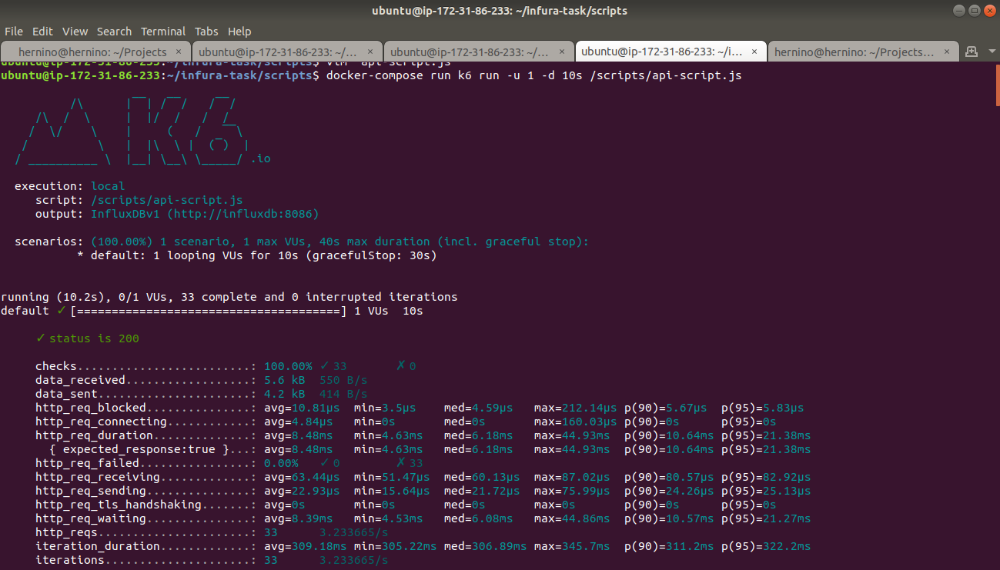
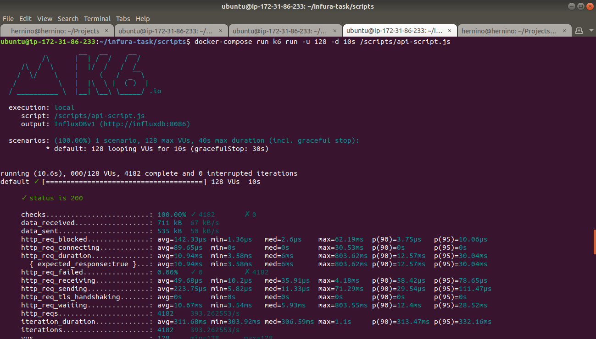
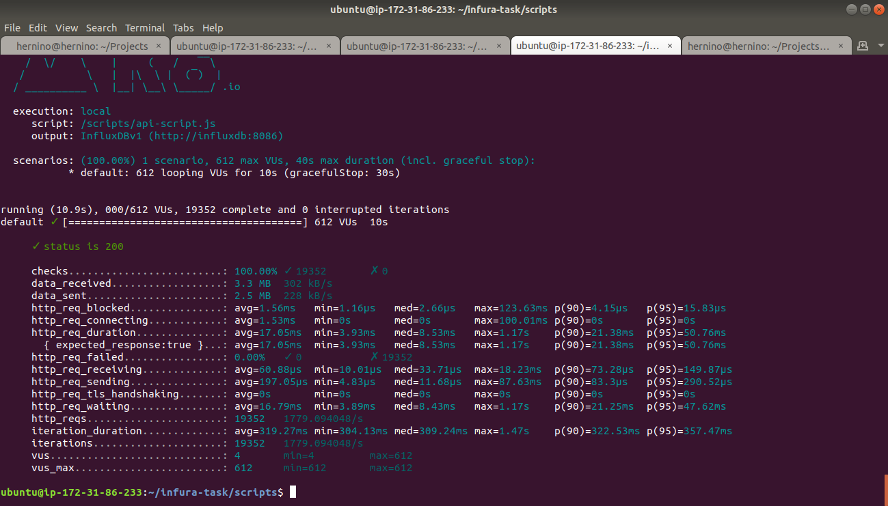
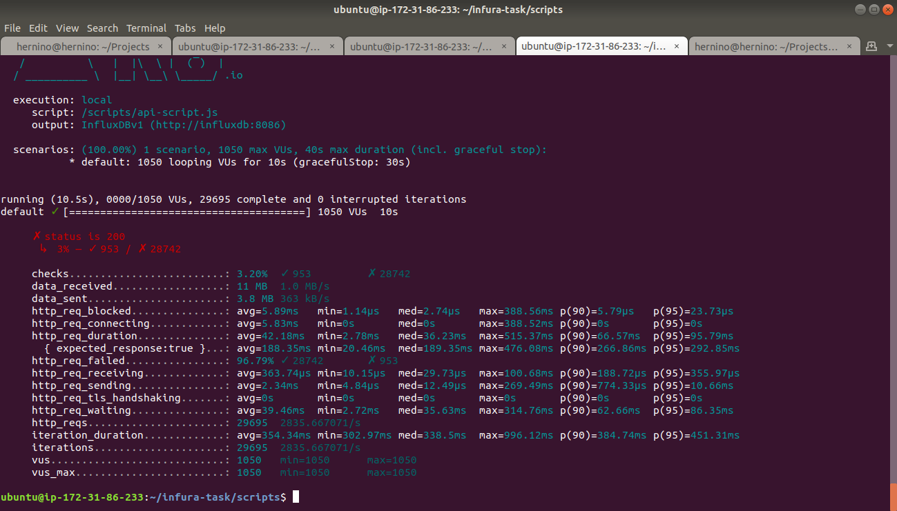

# Ethereum jsonrpc using infura
go to infura.io and register for a free account
to get an API key
cd into the handlers directory and look for the 
handlers.go file, repace every instance of url
in each handler with the url you got from infura..
## Tools used
 ## 1. k6
 Open source l  oad testing tool..scripts are written 
 in javascript.
 ## 2. Influxdb
 Open source time series database to collect data in real time.
 ## 3. Telegraf
 Server-based agent for collecting and sending all metrics from
 databases and systems.
 ## 4. Grafana
 Open source analytics & monitoring solution for databases
 ## 5. Docker Compose
 Tool to run multi-container Docker applications
## Running the setup
* clone the repo
* cd into the repo
* build the docker image `docker build -t godocker . `
* launch the API server `docker run -p 4000:4000 godocker`
* check your private IP `hostname -i`
* go to telegraf.conf and locate the agent section of the 
  file, locate the hostname field and add the **IP** 
  obtained above
* go to the **scripts** folder the look at api the url used
  **api-script.js file** locate where the **http.get** method
  is..to make the requests, add the **IP obtained above**
* launch the monitoring stack of influxdb,telegraf and grafana
  `docker-compose up -d influxdb telegraf grafana`
* go to `IP_obtained:3000` load grafana UI in the browser
* login with **Admin** as user and **admin** as password
* It will prompt you to change password for Admin user
* change the password and it will automatically log you in
* to run tests execute, cd into the scripts directory
  and run `docker-compose run k6 run -u 1 -d 10s /scripts/api-script.js` this command is used to learn 1 virtual user
  in a duration of 10s.

## Go API
The **API** was created usging a Go framework called **gofiber**, built on top of Fasthttp,it offers great performance.
The API has 6 endpoints:
* The root path: /api:4000
* The latest block path: /api/4000/latest-block
* The get transaction path: /api/get-transaction
* The get transaction count path: /api/get-transaction-count
* The get balance transaction path: /api/get-balance
* The get gas price path: /api/get-gas-price

## Load testing 
The load test was done on aws ec2 instance of **type c5.xlarge** meaning it had **4vCPU and 8GB RAM**.The load teststarted by making 1 virtual user making requests for 10 seconds then 2 and so on..users, then I kept **using multiples of 2 until 1024** users, at this point the API allowed limit per day are reached and any subsequent
requests fail..AS you will see in the images below
It's worth noting that for load testing the parameters 
above used limited the duration to 10s..increasing the time
increased the number of interations or loops the virtual user
can make which meant the API day limits were reched quickly.
## Load testing with 1 virtual user

## Load tesing with 2 virtual users

## Load tesing with 4 virtual users

## Load tesing with 8 virtual users

## Load tesing with 16 virtual users

## Load tesing with 32 virtual users

## Load tesing with 64 virtual users

## Load tesing with 128 virtual users

## Load tesing with 256 virtual users

## Load tesing with 512 virtual users

## Load tesing with 612 virtual users

## Load tesing with 712 virtual users

## Load tesing with 1024 virtual users

## Load tesing with 1050 virtual users

## The table sumary:

| **Users**     | **Time** | **Iterations** | **sucessfull** |
| :------------:| :-------:| :-------------:|:--------------:|
| 1             |  10s     |    33          |   100%         |
| 2             |  10s     |    63          |   100%         |
| 4             |  10s     |    131         |   100%         |
| 8             |  10s     |    263         |   100%         |
| 16            |  10s     |    494         |   100%         |
| 32            |  10s     |    1029        |   100%         |
| 64            |  10s     |    2098        |   100%         |
| 128           |  10s     |    4182        |   100%         |
| 256           |  10s     |    8210        |   100%         |
| 512           |  10s     |    15716       |   100%         |
| 612           |  10s     |    19352       |   100%         |
| 712           |  10s     |    21108       |   83%          |
| 1024          |  10s     |    28788       |   79%          |

## The dashboard summary:
* http_req_blocked: Time spent blocked (waiting for a free TCP connection slot) before initiating the request.
 
* http_req_connecting: Time spent establishing TCP connection to the remote host.
 
* http_req_receiving: Time spent receiving response data from the remote host.
 
* ht_req_sending: Time spent sending data to the remote host
 
* http_req_waiting: Time spent waiting for response from    remote host (ie “time to first byte”)

 

## observations 
* Running the test with a higher duration resulted in a
  **high rate of failure**..the more time, the more iterations
  would be made by the virtual users, it would lead to reaching
  **API daily limits** quickly and was not sustainable for 
  conduction tests.
* This test was then conducted by focuing on one end point
  and maintaining a **constant time of 30s**.
* From **1 vrtual** users up to 612 vitual users performing **19352 loops ie iteration** the API was able perfomed extremly well,maintaining a **100% success rate** 
* Between **612 and 712 virtual users** that's the point where
drops started happening. at **712**,the success rate is still high at **83%** and **79% for 1024 virtual users**
* However, there is no doubt that had I increased the duration that the success rate would have decresed significantly due to
a lot of virtual users being able to generate more iterations.
## Conclusions
 The API performed very well based on the following:
 * **Concurrency:** the API was able to handle 1024 concurrent
     users making requests within aperiod of 10s with 
 **a success rate of 79%**.
 * **Server response time:** with 1024 concurrent virtual users,
    **for 95 percentile of request**, the server response time  was **174.91 milli seconds**
* **Throughput:** with 1024 virtual concurrent users,
    **the success rate was 79 %**.This indicates that a few hunders concurrent virtual users could connect to the end point before it crashed.
## Improvements
**Kubernetes:** Given the fact this is a stateless application,
replacing docker-compose with a more powerful tool like **Kubernetes** and it's ecosysem would highly improve all aspects
of the API.
* **Kubernetes Horizantal Pod Scaler and replicas**: by using
    kubernetes, the API would be more **resilient** to failure
    by having **replicas** mainatined at all times distributed 
    to different machines..it would also be possible to scale
    it horizontally by using the **Horizonatlpod Autoscaler** kubernetes concept whereby if the load is too much, new pods are spinned to handle the load and scaling them back down accordingly.

* **Istio:** a service mesh woul run in the same pod as a side car container and bringing fine grained network polices including
security policies, rate limiting, observability and many more.
* **CI/CD:** continious integration tool like github actions
    would aloow to automate the testing including the load testing with K6 because of it's concept of setting Thresholds
    and if they are passed the can the next phase take place
    by combining the CI with a continuous Deployment tool like
    FluxCD, the CI/CD pipeline and version control tool like git
    a complete Devops approach would be in place to setup a robust environment assuming the organization also uses Infrastructure as code.